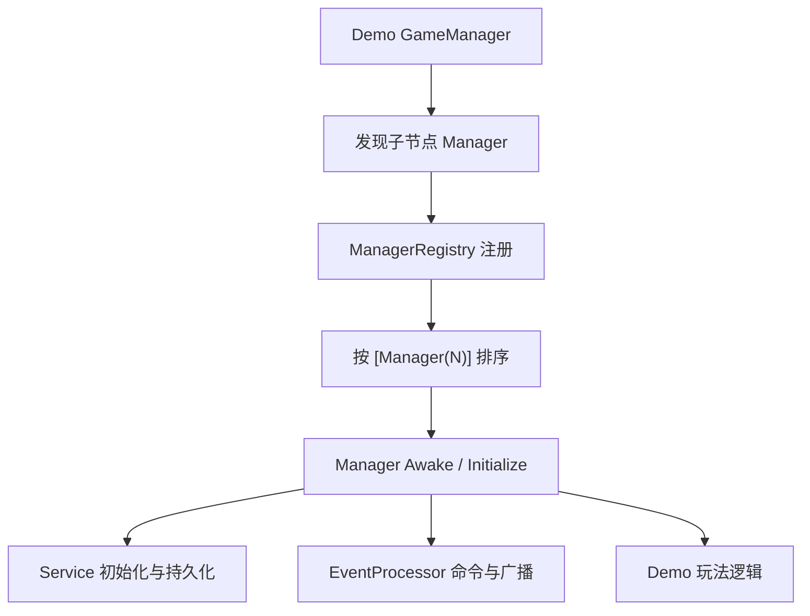

# WulaGameFramework

乌拉的 Unity 游戏框架。

WulaGameFramework 目标是沉淀一套可复用、低耦合、可构建裁剪的游戏基础设施，并通过多个 Demo 持续验证框架能力。项目当前重点关注 Manager 生命周期、事件解耦、资源范围收敛、UI 统一管理、构建期自动化和 Demo 独立发布。

## 项目结构

```text
WulaGameFramework/
├─ Assets/
│  ├─ Agent.md                         # 项目级协作与架构规范
│  ├─ Anti-Patterns.md                 # 反模式黑名单
│  ├─ TODO.md                          # 长期优化事项
│  ├─ Scripts/EssSystem/
│  │  ├─ Core/
│  │  │  ├─ Base/                      # Singleton、Manager、Service、Event 等基础抽象
│  │  │  ├─ Foundation/                # Resource、Data、Network、BuildSystem
│  │  │  ├─ Presentation/              # UI、Audio、Input、Camera、Light、Character、Effects
│  │  │  ├─ Application/               # Entity、Inventory、Skill、Map、Crafting、Farm 等业务系统
│  │  │  ├─ Platform/                  # 平台相关能力
│  │  │  └─ Util/                      # 通用工具
│  │  └─ Manager/                      # 可选第三方或外部系统 Manager，例如弹幕、直播状态
│  ├─ Demo/
│  │  ├─ Cubic/
│  │  ├─ DobeCat/
│  │  └─ Tribe/
│  ├─ FrameworkResources/              # 框架与 Demo 可控资源
│  └─ tools/                           # 文档、事件、编译、编码等检查工具
├─ Packages/
├─ ProjectSettings/
├─ Tools/
└─ Builds/
```

## 分层原则

框架按职责分成 Base、Foundation、Presentation、Application、Demo 几层。

| 层级 | 作用 | 约束 |
|---|---|---|
| Base | 提供事件、Manager、Service、Singleton 等基础抽象 | 不写具体玩法 |
| Foundation | 提供资源、数据、网络、构建等底层能力 | 不依赖 Demo |
| Presentation | 提供 UI、音频、相机、光照、角色表现、特效等表现能力 | UI 生命周期必须回到 UIManager |
| Application | 提供实体、技能、背包、地图、制作、农场、NPC、商店等通用业务系统 | 业务 Manager 之间避免强耦合 |
| Demo | 玩法验证和产品化入口 | 可以依赖框架，不能反向污染框架 |

无法判断代码应该放哪一层时，优先放在更靠近业务的一侧。只有当第二个 Demo 也需要同一能力时，再考虑上移到框架层。

## 运行时核心

核心生命周期由 `Manager<T>`、`Service<T>`、`EventProcessor` 和 `AbstractGameManager` 组成。



当前 `[Manager(N)]` 加载优先级如下，数值越小越早进入 Unity 执行顺序：

| 优先级 | Manager |
|---:|---|
| -30 | EventProcessor |
| -25 | AutoUpdateManager |
| -20 | DataManager |
| 0 | ResourceManager |
| 2 | InputManager、NetworkManager |
| 3 | AudioManager |
| 4 | CameraManager |
| 5 | UIManager |
| 6 | EffectsManager |
| 7 | LightManager |
| 10 | InventoryManager |
| 11 | CharacterManager |
| 12 | MapManager |
| 13 | EntityManager、Voxel3DMapManager |
| 14 | BuildingManager、VoxelLightingManager |
| 15 | DialogueManager、SkillManager |
| 16 | SceneInstanceManager |
| 17 | NpcManager |
| 18 | CraftingManager、FarmManager |
| 19 | ShopManager |
| 50 | LiveStatusManager、BilibiliDanmuManager |

同一优先级内不要依赖固定先后。如果两个 Manager 之间有真实依赖，应拆出接口、事件或显式初始化上下文。

## 事件系统

事件系统用于跨模块低频命令和广播。

基本规则：

- `[Event(...)]` 定义侧必须使用 `EVT_XXX` 常量。
- 跨模块消费方不要为了读取常量而 `using` 对方业务模块。
- 命令型事件使用 `TriggerEventMethod`，广播型事件使用 `TriggerEvent`。
- 跨模块事件参数不要暴露模块私有类型。
- 新增或修改事件后，同步更新对应模块 `Agent.md` 的 `## Event API`。

数据密集型子系统可以保留直接 C# API，但必须在模块 `Agent.md` 中说明理由、适用范围和 public API 清单。MapManager / Voxel3DMapManager 这类地形、chunk、持久化强内聚系统属于可参考方向。

## 资源系统

ResourceManager / ResourceService 是资源访问统一入口。资源策略正在从“全量扫描”收敛为“按 Demo / 模块 / 清单加载”。

当前规则：

- 禁止在通用启动流程里新增无范围 `Resources.LoadAll`。
- Demo 构建只纳入该 Demo 需要的资源和声明共享资源。
- Tribe 默认只使用 `FrameworkResources/Tribe` 及其声明依赖的共享资源。
- Editor 调试可以全量加载指定 Demo 资源目录，但必须可控，不能影响构建包。
- Addressable、Resources、FrameworkResources 的选择要通过统一入口表达。

## UI 系统

UI 生命周期由 UIManager 统一管理。

规则：

- 禁止业务代码随处自建 Canvas 或绕过 UIManager 管窗口。
- 窗口打开、关闭、层级、输入阻挡都要回到 UIManager。
- Demo 可以有自己的 UI 样式构建器，但生命周期和资源入口要统一。
- Tribe 当前 UI 参考 DobeCat 的窗口结构，同时保留自己的像素风主题。

## 构建系统

BuildSystem 是构建期自动化入口。

构建目标：

- 每个 Demo 保持独立构建入口，例如 DobeCat Build 与 Tribe Build 分开维护。
- 构建时自动刷新必要生成物，例如资源清单、角色清单、配置索引、版本信息。
- 每次 Demo 版本构建必须更新版本号，便于服务器区分部署包。
- 构建日志需要能定位目标 Demo、资源范围、版本号和失败原因。

AutoUpdateManager 的构建期能力应收敛进 BuildSystem，避免手动多走一遍配置流程。

## Demo

| Demo | 定位 |
|---|---|
| Cubic | 早期战斗、技能、VFX 和地图验证 Demo |
| DobeCat | 桌宠、UI、直播、农场等系统验证 Demo |
| Tribe | 像素风生存/部落方向 Demo，重点验证资源裁剪、UI、制作、背包、对话、地图与启动性能 |

Demo 可以快速验证玩法，但不要把 Demo 专属路径、资源规则或 UI 特例硬编码进框架公共层。

## 文档入口

推荐阅读顺序：

1. `Assets/README.md` 不存在时，以本文件作为总览入口。
2. `Assets/Agent.md`：项目级协作、架构和检查规范。
3. `Assets/Anti-Patterns.md`：禁止写法和历史旧路。
4. 目标模块目录下的 `Agent.md`：模块职责、Event API、修改规则。
5. `Assets/TODO.md`：长期优化事项。

## 常用检查

在 `Assets/` 目录下执行：

```powershell
powershell -ExecutionPolicy Bypass -File .\tools\agent_lint.ps1 -Strict
powershell -ExecutionPolicy Bypass -File .\tools\check_compile_errors.ps1 -TopN 999
powershell -ExecutionPolicy Bypass -File .\tools\encoding_lint.ps1
```

常见用途：

| 工具 | 作用 |
|---|---|
| `agent_lint.ps1 -Strict` | 检查 Event 常量、模块 Agent 文档、全局事件索引 |
| `check_compile_errors.ps1 -TopN 999` | 检查 Unity 编译错误、警告和常见静态问题 |
| `encoding_lint.ps1` | 检查中文文档编码问题 |
| `new-module.ps1` | 创建符合框架约定的新模块骨架 |
| `install-hooks.ps1` | 安装提交前检查 hook |

## 开发约定

提交前至少确认：

- 没有新增 Unity 编译 error / warning。
- 没有新增无范围资源扫描。
- 没有把 Demo 专属逻辑塞进框架公共层。
- 新增或修改 Event 后，模块 `Agent.md` 已同步。
- Manager 顺序调整后，类上的 `[Manager(N)]` 和文档顺序表已同步。
- 中文文档保持 UTF-8，无乱码。
- UI 变更经过截图或运行表现确认，不只看数值。

## 当前重点

近期框架重点维护方向：

- EntityManager 与 SkillManager 继续保持解耦。
- ResourceService / ResourceManager 继续收敛运行时扫描范围。
- Tribe 构建只纳入 Tribe 资源和声明共享资源。
- BuildSystem 继续统一构建期自动生成、版本更新和资源清单。
- 工具菜单和编辑器入口继续整理成清晰层级。

更多细节请从 `Assets/Agent.md` 和对应模块 `Agent.md` 开始阅读。
